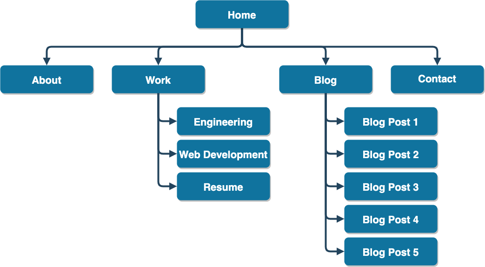
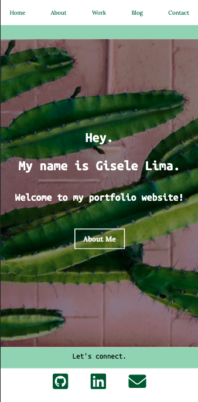
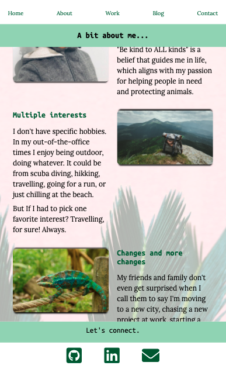
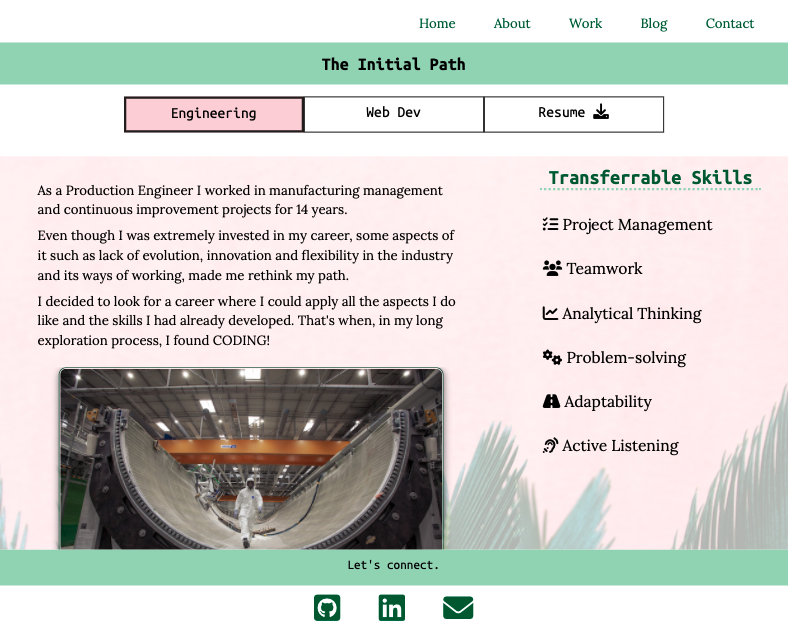
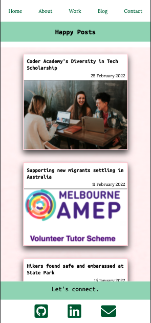
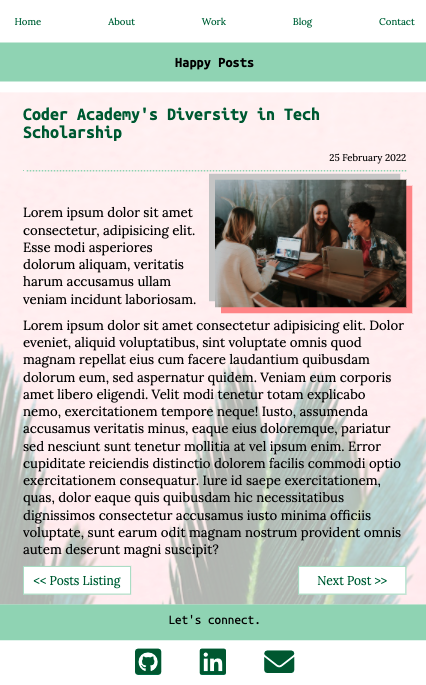
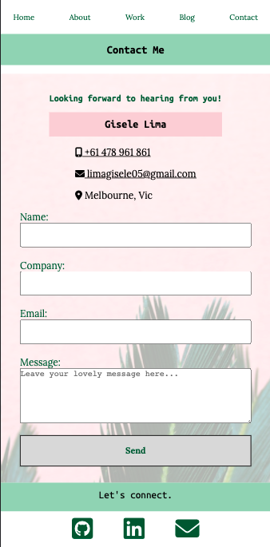

# Portfolio Website Project

#### Description
___
This project has the purpose to plan, develop and deploy a personal online portfolio as part of the Term 1 assignment of the Coder Academy Accelerated Bootcamp.

[Explore here the related GitHub repo](https://github.com/limagisele/portfolio)  
[And here the published portfolio website](https://giselelima.netlify.app/)  

##### Table of Contents
1. Purpose
2. Target Audience
3. Tech Stack
4. Sitemap
5. Functionality / Features
6. Screenshots

#### 1. Purpose
---
My portfolio website provides a showcase of my work as a web developer, which contains 11 HTML and 1 CSS files. Additionally, it includes as well some information about me, my personal interests and drives, previous career and the transferrable skills I bring along into my new career as a developer. 

#### 2. Target Audience
___
Potential employers and recruiters willing to engage with a developer and/or a professional in tech who has recently completed a bootcamp.

It is assumed here that those employers/recruiters have technical knowledge relating to IT, software development, programming languages and development stacks. Combined with high expectations of professionalism and positive work ethic.

#### 3. Tech Stack
___
This portfolio was built using my skills on:
* HMTL5
  * Accessibility
* CSS3
  * Flexbox
  * Effects & Animation
* Git / GitHub
* Deployment (Netlify)
* Responsive design (Mobile First)

#### 4. Sitemap
___

#### 5. Functionality / Features
___
##### Global styling
* Consistent design, sharing a common theme, across all pages, including html semantics, fonts, colours and language
* Responsive navbar and always visible on screen
* Footer with social media and email links  
  Positioned always visible at bottom of the page for an easier access to links and to bring attention to the user.
* Flexbox utilised to create a design responsive in three different screen sizes
* Background image with overlay effect
* Pseudo-classes used to create effects on cards, links and buttons
##### Index / Home page
* Hero banner with overlay effect calling for action through animated button for attention of the user
##### About page
* Made of 3 containers with image and text illustrating separate personal topics  
##### Work & Work2 pages
* The two pages were created to present the skills and background of my previous career as a Production Engineer and my current path of becoming a Web Developer. 
* Additional nav buttons linking the two career related pages and a resume file for download in pdf format
##### Blog page
* Cards utilised to list all blog posts in a graphic way, including their publishing dates
##### Blog Post pages
* Buttons added as footer of the blog posts to link to previous and next posts for a more convenient transition for the user
##### Contact page
* Form added as an additional option of contact
* Animation included to encourage the user to initiate a first contact after seeing my website

#### 6. Screenshots
---
##### Home

##### About

##### Work

##### Blog

##### Blog Post

##### Contact
